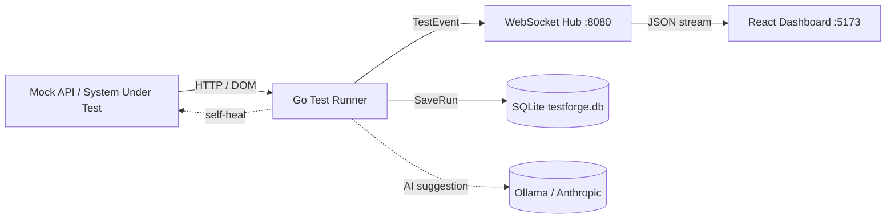

# testforge — Self-Healing Test Dashboard

**testforge** is a Go test-automation framework with a twist: when a UI test's
selector breaks, it heals itself, and when a test fails for real, it asks a local
LLM for a one-line suggested fix. A live, single-focus dashboard shows one test at
a time — big status, name, one line of detail — with a thin dot trail for history
and three plain totals. Built as a portfolio piece for a QA / test-automation role.

## Why it's interesting

- **Self-healing selectors** — no more red builds because someone renamed a
  button class. The runner scores the live DOM and swaps in the best match.
- **AI root-cause suggestions** — failures that can't be healed get a concise
  suggested fix from a local Ollama model (or Anthropic), shown inline.
- **Live, minimal dashboard** — one test centered, not a wall of tables.

## Architecture



Plain version:

```
 Mock API (system under test)  ──►  Go test runner  ──►  WebSocket hub (:8080)
                                          │                    │
                                   SQLite (history)     React dashboard (:5173)
                                          │
                                    Ollama / Anthropic  (failure suggestions)
```

## Quick start (Docker)

```bash
docker compose up -d
```

Then open **http://localhost:5173**. The dashboard connects to
`ws://localhost:18080/ws` and shows the latest test as the suite runs.

- In interactive mode the backend runs the suite **once per dashboard
  connection** — load the page (or refresh it) and you'll see a fresh run;
  it doesn't keep re-running on a timer while the tab just sits open. (CI
  mode runs once and exits.)
- The Go service publishes its WebSocket on host port **18080** (host 8080 is
  often taken by other tools); the dashboard is on **5173**.
- SQLite is persisted to `./data/testforge.db` via a volume.

Useful env vars (in `docker-compose.yml` or your shell):

| Var | Purpose | Default |
| --- | --- | --- |
| `SHOWCASE_FAILURES` | include the intentional failures so the demo shows retry / healing / AI | `1` |
| `OLLAMA_MODEL` | local LLM model for failure suggestions (e.g. `qwen2.5-coder:7b`) | off |
| `OLLAMA_BASE_URL` | Ollama base URL | `http://localhost:11434/v1` |
| `ANTHROPIC_API_KEY` | use Anthropic instead of Ollama | off |
| `CHROME_PATH` | Chrome/Chromium binary for headless UI tests | `/usr/bin/google-chrome` |
| `PASS_THRESHOLD` | min pass rate % to keep CI green | `80` (CI only) |
| `LOOP_DELAY_SECONDS` | minimum cooldown between connection-triggered runs | `6` |
| `VITE_WS_URL` | dashboard WS endpoint | `ws://localhost:18080/ws` |

## Local dev (no Docker)

```bash
# terminal 1 — run the suite (starts an in-process mock API + WS server)
go run ./cmd/testforge

# terminal 2 — dashboard
cd dashboard && npm install && npm run dev
```

Set `SHOWCASE_FAILURES=1` on the Go run to see the failure/heal/AI showcase. Set
`OLLAMA_MODEL=qwen2.5-coder:7b` (with Ollama running) to get live AI suggestions.
The backend runs the suite once per dashboard connection, not on a repeating
timer — open the page for a fresh run, refresh for another one.

## How self-healing works

When a UI test can't find its selector, the runner doesn't give up — it:

1. Grabs the page's full DOM (`chromedp.OuterHTML`).
2. Parses it and walks **every element**, scoring each against the original
   selector with a simple heuristic:
   - **+2** for a matching tag (e.g. `button`),
   - **+3** for a shared **class** substring (e.g. `.submit` matches `submit-btn`),
   - **+5** if the element's visible text contains a class token,
   - **+3** for a shared **id** substring,
   - **+5** if the text contains the id token.
3. Picks the highest-scoring element and builds a real CSS selector for it
   (preferring the renamed class, then id, then tag).
4. If that candidate scores at or above the threshold (**3**) **and** actually
   resolves to an element on the page, the test is re-checked with the new
   selector and reported as `healed`, carrying `old → new` in its metadata.

So a button renamed from `submit` to `submit-btn` heals automatically, and the
dashboard shows `~~.submit~~ → .submit-btn`.

## AI suggestions

For failures that can't be healed (wrong status, network error, dead host), the
runner sends the failure context (name, type, error type, message, URL) to a model
and shows the one-line reply in the same detail slot. Provider is chosen from the
environment: `ANTHROPIC_API_KEY` → Anthropic, otherwise `OLLAMA_MODEL` → local
Ollama. With neither set, AI is skipped gracefully.

## CI

`.github/workflows/ci.yml` runs `go vet`, `go test ./...` (headless Chrome via
`browser-actions/setup-chrome`), builds the dashboard, runs the suite, and fails
the build if the pass rate drops below `PASS_THRESHOLD` (80%). `SHOWCASE_FAILURES`
is unset in CI so the suite stays green; `testforge.db` is uploaded as an artifact.

## Demo

<!-- TODO: record a short screen capture of the dashboard healing a broken
     selector live and add it here as demo.gif -->


## Project layout

```
cmd/testforge   entrypoint: mock API + WS server + suite + persistence
cmd/mockapi     standalone "system under test" service
runner/         API + UI runners, retry, sequential suite, DOM healing
events/         the shared TestEvent contract
server/         WebSocket pub-sub hub
storage/        SQLite persistence
ai/            failure → suggestion (Ollama / Anthropic)
mockapi/        in-process mock API (fixed status codes + demo shop page)
dashboard/      React + Vite single-focus dashboard
docker/         Go service Dockerfile
dashboard/Dockerfile
docker-compose.yml
```
