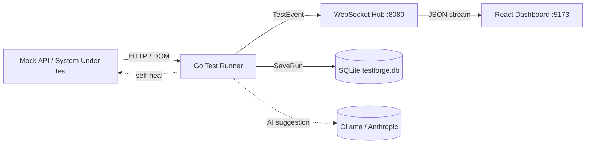

# testforge — Self-Healing Test Dashboard

A Go test-automation framework with a twist: when a UI test's selector
breaks, it heals itself, and when a test fails for real, it asks an LLM for a
root-cause suggestion — or a full-run summary. A live React dashboard shows
it all happening as a mindmap. Built as a portfolio piece for a QA /
test-automation role.

## Architecture



## Quick start (Docker)

```bash
docker compose up -d
```

Open **http://localhost:5173**. The dashboard connects to
`ws://localhost:18080/ws` and runs the suite once per connection — load the
page (or refresh it) for a fresh run. It doesn't loop on a timer while the
tab just sits open. CI mode runs once and exits.

The Go service publishes its WebSocket on host port 18080 (8080 is often
taken by other tools); the dashboard is on 5173. SQLite persists to
`./data/testforge.db` via a volume.

Env vars (in `docker-compose.yml` or your shell):

- `SHOWCASE_FAILURES` — include the intentional failures so the demo shows retry / healing / AI. Default `1`.
- `OLLAMA_MODEL` — local LLM for suggestions and summaries, e.g. `qwen2.5-coder:7b`. Off by default.
- `OLLAMA_BASE_URL` — Ollama base URL. Default `http://localhost:11434/v1`.
- `ANTHROPIC_API_KEY` — use Anthropic instead of Ollama. Off by default.
- `CHROME_PATH` — Chrome/Chromium binary for headless UI tests. Default `/usr/bin/google-chrome`.
- `PASS_THRESHOLD` — min pass rate % to keep CI green. `80` in CI only.
- `LOOP_DELAY_SECONDS` — minimum cooldown between connection-triggered runs. Default `6`.
- `VITE_WS_URL` — dashboard WS endpoint. Default `ws://localhost:18080/ws`.

## Local dev (no Docker)

```bash
# terminal 1 — run the suite (starts an in-process mock API + WS server)
go run ./cmd/testforge

# terminal 2 — dashboard
cd dashboard && npm install && npm run dev
```

Set `SHOWCASE_FAILURES=1` to see the failure/heal/AI showcase, and
`OLLAMA_MODEL=qwen2.5-coder:7b` (with Ollama running) for live AI output.

## How self-healing works

When a UI test can't find its selector, the runner:

1. Grabs the page's full DOM.
2. Walks every element, scoring each against the original selector — tag
   match, shared class/id substrings, whether the visible text contains the
   old class or id.
3. Takes the highest-scoring candidate and builds a real selector for it.
4. If that candidate clears the score threshold and actually resolves on the
   page, the test is re-checked and reported `healed`, with old → new
   selector attached.

So a button renamed from `.submit` to `.submit-btn` heals itself, and the
dashboard shows the old selector struck through, pointing at the new one.

## AI

Failures that can't be healed (wrong status, network error, dead host) get a
one-line root-cause suggestion. After the full suite finishes, a second call
writes a short plain-English summary of the whole run — what broke, what
healed, what still needs a person. Provider is picked from the environment:
`ANTHROPIC_API_KEY` → Anthropic, else `OLLAMA_MODEL` → local Ollama. With
neither set, AI is skipped.

## CI

`.github/workflows/ci.yml` runs `go vet`, `go test ./...` (headless Chrome
via `browser-actions/setup-chrome`), builds the dashboard, runs the suite,
and fails the build if the pass rate drops below `PASS_THRESHOLD`.
`SHOWCASE_FAILURES` is unset in CI so the suite stays green.
